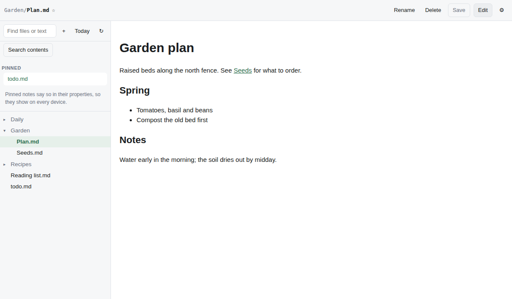

# Notes

Markdown notes in your own GitHub repository, from any browser, computer or
phone. Every note is a plain file and every save is an ordinary commit, so
nothing is locked in: the same repository works in Obsidian, on github.com
or in any editor. There is no Notes server, database or account; the app is
a single web page.



## Try it

The shared copy below is ready to use: sign-in is configured and its
GitHub App is public.

1. Open [Notes](https://forwardmotionnz.github.io/notes/) on your computer or
   phone. You need a GitHub account and an internet connection.
2. Choose **Sign in with GitHub**. When GitHub asks where to install Notes,
   choose only the private repository you want to use for notes.
   A repository is a folder of files on GitHub, with a history of your changes.
   [No notes repository yet?](docs/guide.md#no-notes-repository-yet) Follow the two steps
   in Notes to create one and let the app use it.
3. Back in Notes, choose your repository if asked, then press **Save** to
   close settings. On a phone, open **☰ Files** first. Press **+** (*New note*)
   in the file list, give your note a name such as `Hello.md`, write a few
   words and press **Save** above the editor.
   Your note is now a plain file in your repository; you can edit it in
   Obsidian or on GitHub too.

Read the [privacy note](PRIVACY.md) before signing in. Notes reads and writes
files in repositories its GitHub App is installed on that you can access;
this may include repositories someone else installed it on. The app's owner
also has access through that installation. Only use a copy whose owner you
trust. To run your own copy, see [Running your own copy](docs/self-hosting.md).

## What it does

- **Write anywhere.** Folders, filtering and search across note contents;
  an editor that saves itself (one commit per save) and keeps unsaved words
  in the browser, so a reload, a closed tab or a phone closing the app in
  the background loses nothing.
- **Never overwrites anyone.** If a note changed elsewhere, changes to
  different lines are merged; otherwise you keep both versions.
- **Pinned checklists.** Pin a note (the pin is saved in the note, so it
  follows you to every device) and tick, add and remove its tasks.
- **Daily notes**, Markdown **preview** with images from the repository,
  **wikilinks**, rename, move and delete.
- **Works with Obsidian vaults** as they are: hidden folders, attachments,
  frontmatter and line endings are left alone.
- **Phones**: add it to the home screen; the editor stays above the keyboard.

The [guide](docs/guide.md) covers all of it in detail, including what happens
when something fails.

## Privacy and trust

Your notes go only between your browser and GitHub. A tiny helper (the
*broker*) swaps GitHub's sign-in code for a token, because a web page cannot
keep the secret that needs; it stores and logs nothing. The page may talk to
GitHub and the broker only, which its security policy enforces, and every
library it loads is pinned to its exact contents. The
[privacy note](PRIVACY.md) says exactly who sees what, including what you
trust when you use someone else's copy.

## How it fits together

```
 browser ──── sign in ────▶ github.com ──── code ────▶ browser
    │                                                     │
    │                       broker (Cloudflare Worker)    │
    │   code + PKCE ───────▶ holds the client secret ─────┘
    │   ◀──────── token ─── swaps code for token
    │
    └──────── every read and write ────────▶ api.github.com
```

GitHub requires a client secret to turn a sign-in code into a token, and a web
page cannot keep a secret. The broker (`broker/worker.js`, about 100 lines)
holds it and does only that swap, plus a refresh every 8 hours. It stores
nothing and never sees your notes: those go straight from the browser to
GitHub.

## Documentation

- [Guide](docs/guide.md): using Notes, in detail
- [Running your own copy](docs/self-hosting.md): your own page, GitHub App and broker
- [Privacy](PRIVACY.md)
- [Changelog](CHANGELOG.md)
- [Contributing](CONTRIBUTING.md) and [security reports](SECURITY.md)

## Reporting a bug

Use the [bug report template](.github/ISSUE_TEMPLATE/bug_report.md) to describe
your device, browser, the steps you took, and what you expected to happen.
Use made-up note text and remove private details from screenshots and messages.
Copy your answers into [a new issue](https://github.com/forwardmotionnz/notes/issues/new).
Security problems are different: please report them privately, as
[SECURITY.md](SECURITY.md) explains.

## Contributing

Contributions are welcome. [CONTRIBUTING.md](CONTRIBUTING.md) explains the
few design rules, how to run the tests and what makes a change easy to
accept. This is a small project kept in spare time: issues and pull requests
are read, but replies can take a while.

## Licence

MIT. See [LICENSE](LICENSE).
